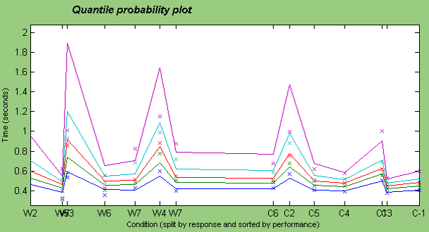
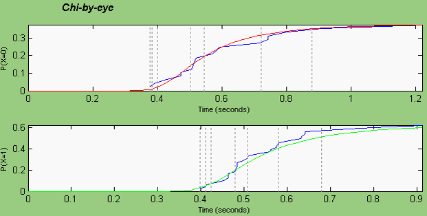
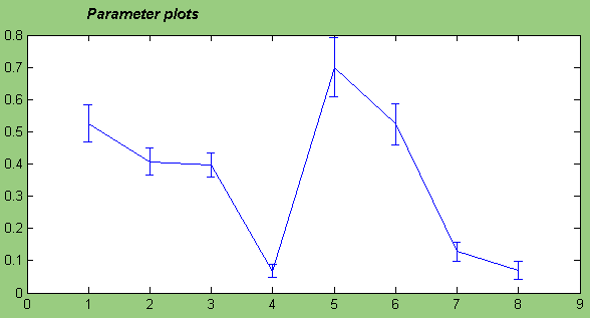

# 小组作业
----

# 自由组合
 - 4人一小组
 - 确定好小组后，组内一人将所有组员的名单发送到助教邮箱
 - zhangqipsy@163.com
 - 在5月28日没有确定分组的同学请在5月28日晚7点前和助教联系，可在9点后登陆教学网上看最后分组。
 - 第一次上机时间5月29日下午1:00-3:00 哲学楼120,122机房。
----

# Diffusion model
 - 实验任务：
    + 字母辨别任务。每一组都包含两个不同的字母（比如T和D），根据指导语的要求做简单的按键反应，如T按左键，D按右键。字母在中央视野呈现。字母与不同程度的噪音（随机点）合成，分为4个难度（SNR：0.5, 0.4, 0.3,0.2）。被试的任务完成有两种指导语（Accuracy‐speed tradeoff），一是要求被试尽快反应（Speed组）；二是要求被试尽量获得高正确率（Accuracy组）。
 - 自行编写程序，采集实验数据（组内2名被试）。
 - 实验为 将实验行为数据为输入模型工具包，拟合并预测反应时分布和正确与错误试次的比率。
----

# 具体程序及设置

- Diffusion model 需要的参数:
  1. 条件编号
  2. 正确错误
  3. 反应时
----

# 结果图参考

----

----

----

# Sparse coding
 - 以自然图片为输入提取与V1简单神经元感受野类似的基函数。
 - Olshausen的源程序可用于参考，如采用其中的部分函数或代码，需要在报告中具体声明。
 - 图片集需自己采集，不能用Olshausen程序包中的图片。
 - 必须有一组自然图片的结果。
 - 鼓励尝试其他类型的图片，如面孔图片、汉子图片等，作为输入，看训练的基函数具备什么特征。
----

# Sparse Coding
 - 文件夹\sparsenet中包含Olshausen的源程序，可用于参考，如采用其中的部分函数或代码，需要在报告中具体声明。
 - 文件夹\images中包含输入的自然图片，文件夹\sparsenet中也包含一个图片集，但仅作参考，不能在本作业中使用。
----
